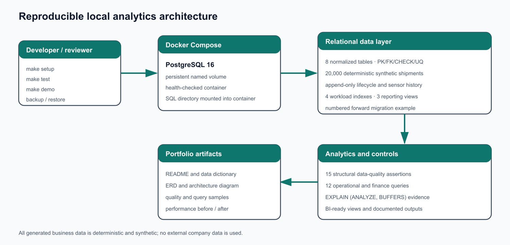
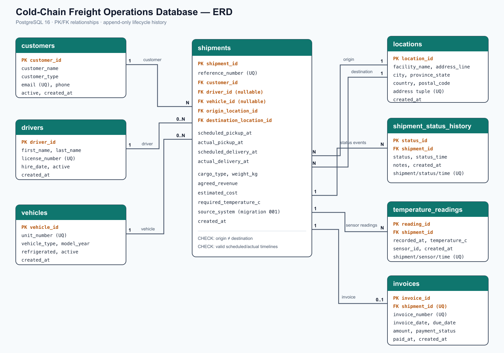

# Cold-Chain Freight Operations Database

A PostgreSQL portfolio project that models refrigerated freight operations, validates data integrity, and turns shipment, temperature, and receivables data into decision-ready SQL analysis.

> All records are deterministic synthetic data. This project is not affiliated with Scotlynn or any other carrier and does not contain company data.



## What this project demonstrates

- A normalized PostgreSQL 16 model with 8 related tables, identity keys, foreign keys, `CHECK` constraints, uniqueness rules, and deliberate delete behavior.
- 20,000 reproducible shipments with lifecycle events, 231,225 temperature readings, and 19,097 invoices.
- 15 executable structural data-quality checks plus intentional operational exceptions for late freight, cold-chain excursions, unassigned work, and overdue receivables.
- 12 business queries using CTEs, filtered aggregates, subqueries, `LAG`, rolling windows, `ROW_NUMBER`, and `DENSE_RANK`.
- Workload-driven composite and partial indexes validated with real `EXPLAIN (ANALYZE, BUFFERS)` plans.
- Repeatable Docker setup, automated acceptance tests, reporting views, a forward migration, and verified `pg_dump`/`pg_restore` scripts.

## Verified snapshot

The following figures come from `make setup && make test` on PostgreSQL 16.14:

| Metric | Actual result |
|---|---:|
| Shipments | 20,000 |
| Delivered | 19,097 |
| Late deliveries | 4,202 |
| On-time delivery | 78.00% |
| Cancelled | 689 |
| Open, non-cancelled | 214 |
| 2025 shipments still open | 0 |
| Status-history events | 101,832 |
| Temperature readings | 231,225 |
| Invoices | 19,097 |
| Delivered revenue | $87,799,745.80 |
| Estimated margin | $21,958,715.80 |

Customer on-time rates range from 76.72% to 79.58%; no customer or driver has an artificial 0% or 100% result caused by an ID cycle.

## Run it locally

Requirements: Docker Desktop with Docker Compose and GNU Make.

```bash
git clone https://github.com/Volianwt/sql_cold_chain.git
cd sql_cold_chain
cp .env.example .env
make setup
make test
make demo
```

`make setup` starts the health-checked container, rebuilds and seeds the database, applies numbered migrations, creates indexes, and installs reporting views. It is safe to repeat in this development project. `make test` returns a non-zero exit code if a structural check, expected count, migration, index, view, or business-query execution fails.

## Data model



The central `shipments` table connects customers, optional driver/vehicle assignments, and two roles of `locations`. Lifecycle state is append-only in `shipment_status_history`; the current state is derived from the latest event. Temperature readings are one-to-many, while each delivered shipment has at most one invoice.

See the complete [data dictionary](docs/data_dictionary.md).

## Business analysis

[`sql/04_business_queries.sql`](sql/04_business_queries.sql) answers 12 operational and finance questions, including:

1. Executive shipment, revenue, and margin KPIs.
2. Customer delivery reliability and revenue performance.
3. Highest-volume freight lanes.
4. Latest status for active exception shipments.
5. Month-over-month revenue growth.
6. Three-month rolling operating trends.
7. Monthly top-three customers by revenue.
8. Driver delivery performance.
9. Serious temperature excursions.
10. Accounts-receivable aging.
11. Above-average lifetime customer revenue.
12. A combined severity-scored exception report.

Representative verified output is in [business query samples](results/business_query_samples.md).

## Data quality and operational controls

[`sql/03_data_quality_checks.sql`](sql/03_data_quality_checks.sql) asserts 15 structural rules. These cover missing values, duplicate business keys and sensor events, broken relationships, invalid timelines, origin/destination conflicts, status/timestamp consistency, invoice consistency, and temperature-reading coverage. Any structural issue raises an exception.

The seed deliberately retains reviewable business exceptions without violating integrity:

| Operational exception | Count |
|---|---:|
| Outstanding invoices | 5,709 |
| Overdue invoices | 5,611 |
| Late completed deliveries | 4,202 |
| Shipments with a temperature excursion | 2,375 |
| Currently unassigned, non-cancelled shipments | 39 |

See the [data-quality summary](results/data_quality_summary.txt).

## Index and query-plan evidence

[`sql/05_indexes_and_performance.sql`](sql/05_indexes_and_performance.sql) drops the four portfolio indexes, captures baseline plans, creates the indexes, runs `ANALYZE`, and repeats the same queries. One measured run produced:

| Scenario | Before | After | Plan change |
|---|---:|---:|---|
| Latest status for all shipments | 30.966 ms | 22.823 ms | incremental sort/index scan → ordered index-only scan |
| Oldest open exceptions | 1.020 ms | 0.066 ms | sequential scan + sort → partial index-only scan |
| Oldest outstanding invoices | 1.374 ms | 0.045 ms | sequential scan + sort → partial index-only scan |
| Customer delivery slice | 0.945 ms | 0.108 ms | sequential scan → bitmap index/heap scan |

These are local portfolio measurements, not production benchmarks; cache state, hardware, PostgreSQL statistics, and data volume affect timings. A separate temperature index was intentionally omitted because the existing unique index already narrows each shipment to only 15 readings, so an additional index did not produce a convincing plan benefit at this scale. Details are in [performance notes](docs/performance.md).

## Reporting views and BI handoff

[`sql/06_reporting_views.sql`](sql/06_reporting_views.sql) exposes:

- `vw_shipment_current_status`
- `vw_customer_delivery_performance`
- `vw_invoice_aging`

These stable interfaces are ready for Power BI or Tableau. A production extension could add row-level security, incremental ingestion, geospatial lane analysis, and scheduled materialized-view refreshes.

## Backup, restore, and migration

Create a compressed custom-format backup:

```bash
make backup
```

Restore into an isolated verification database (the script refuses to overwrite `freight_ops`):

```bash
make restore BACKUP=backups/freight_ops_YYYYMMDDTHHMMSSZ.dump
```

[`sql/migrations/001_add_source_system.sql`](sql/migrations/001_add_source_system.sql) is an idempotent forward migration that adds shipment lineage for future TMS, EDI, and manual integrations. In a production deployment, numbered files would be immutable and recorded by a migration tool or deployment ledger.

## Design decisions and trade-offs

- The dataset uses a fixed reporting date of **2026-07-16** so invoice aging and exception reports remain reproducible. Each query file defines the anchor once.
- Current shipment state is derived from append-only history instead of duplicated on `shipments`. This avoids update anomalies at the cost of a latest-row query, supported by `idx_status_latest` and a reporting view.
- A single `vehicle_id` simplifies tractors and trailers into one assigned asset. A production fleet model would separate power units, trailers, and assignment periods.
- Seed formulas are deterministic and block-aware so customer and driver outcomes are varied without pretending to be statistically representative of a real carrier.
- The schema reset is intentionally destructive for local reproducibility; backup and restore scripts use a separate target database for verification.

## Repository map

```text
sql/          schema, deterministic seed, checks, analysis, indexes, views, migration
scripts/      setup, test, demo, backup, and guarded restore automation
docs/         ERD, architecture, data dictionary, and performance notes
results/      concise outputs captured from actual database execution
```

## License

MIT — see [LICENSE](LICENSE).
